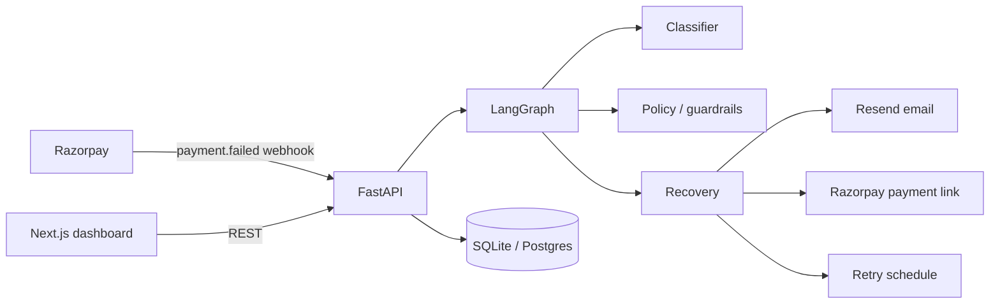

# Razorpay Lost Revenue Recovery

**AI-assisted payment-failure recovery engine** — ingest a failed Razorpay payment, classify why it failed, apply safety guardrails, run the right recovery action, and show merchants exactly what happened.

Built as a full-stack PoC: **FastAPI + LangGraph** orchestration, **Resend** email outreach, **Razorpay** payment links / retries, and a **Next.js** merchant dashboard.

---

## Live demo (for judges)

| Surface | URL |
|--------|-----|
| **Merchant dashboard** | [https://razorpay-lost-revenue-recovery.vercel.app](https://razorpay-lost-revenue-recovery.vercel.app) |
| **API health** | [https://razorpay-revenue-recovery-api.onrender.com](https://razorpay-revenue-recovery-api.onrender.com) |
| **Metrics JSON** | [https://razorpay-revenue-recovery-api.onrender.com/metrics/](https://razorpay-revenue-recovery-api.onrender.com/metrics/) |
| **Source code** | [github.com/Hrishikesh-Kothe/Razorpay-Lost-Revenue-Recovery](https://github.com/Hrishikesh-Kothe/Razorpay-Lost-Revenue-Recovery) |

> **Note:** The Render free tier may cold-start (~30–60s) on the first API request. If the dashboard briefly shows offline, refresh once the health endpoint returns `{"status":"ok"}`.

### 60-second walkthrough

1. Open the **dashboard** — confirm **Engine Online**.
2. Read the KPI row: failed payments, failed value, recovered ₹, still open, success rate, yield.
3. Open **View all transactions** → click any row → inspect the **timeline** + progress states.
4. On a non-opted-out transaction, click **STOP recovery** to demo the opt-out guardrail.
5. Optional API smoke test:

```bash
curl https://razorpay-revenue-recovery-api.onrender.com/
curl https://razorpay-revenue-recovery-api.onrender.com/metrics/
```

---

## Problem

When a customer payment fails, merchants often lose the sale forever:

- Bank / gateway downtime → customer never retries
- Insufficient funds → no follow-up when balance recovers
- Cart abandonment after a failed checkout → no discounted second chance

Those failures are **recoverable revenue** — if you act fast, safely, and with an audit trail.

## Solution

This engine turns a payment-failure webhook into a governed recovery workflow:

```text
Razorpay failure webhook
        │
        ▼
   Ingest + audit
        │
        ▼
   LangGraph pipeline
   classify → policy → execute
        │
        ├── BANK_DOWNTIME        → schedule auto-retry (+6h)
        ├── INSUFFICIENT_FUNDS   → recovery email (Resend)
        └── CART_ABANDONMENT     → Razorpay payment link (−5%)
        │
        ▼
   Merchant dashboard (metrics, timeline, STOP)
```

---

## What it does

| Capability | Detail |
|------------|--------|
| **Webhook ingest** | `POST /webhooks/razorpay` creates a transaction + audit log, then runs the graph |
| **Classification** | Maps error codes → `BANK_DOWNTIME` / `INSUFFICIENT_FUNDS` / `CART_ABANDONMENT` / `UNKNOWN` |
| **Policy guardrails** | Max **3** recovery attempts · customer **STOP / opt-out** · full audit trail |
| **Recovery actions** | Retry scheduling · formal English email outreach · discounted payment link |
| **Merchant UI** | KPI equations, path/outcome charts, live transaction list, timeline drawer |
| **Demo dataset** | Deterministic 36-failure walkthrough seed (recovered + pending + failed mix) |

### How dashboard numbers add up

| Metric | Meaning |
|--------|---------|
| **Failed payments** | Count of ingested payment failures |
| **Failed value** | Sum of every failed amount |
| **Recovered** | ₹ won back (and how many payments) |
| **Still open** | Failed value − recovered |
| **Success rate** | Recovered payments ÷ all failures |
| **Recovery yield** | Recovered ₹ ÷ failed value |

Identities shown on the UI:

- `recovered + failed + pending = failed payments`
- `recovered ₹ + still open = failed value`

---

## Architecture



| Layer | Stack |
|-------|--------|
| API | FastAPI, SQLAlchemy, LangGraph, uvicorn |
| Data | SQLite (local) · PostgreSQL (Render) |
| Integrations | Razorpay SDK · Resend HTTP API |
| Frontend | Next.js 16, Recharts, Lucide |
| Deploy | Backend → Render Docker · Frontend → Vercel |

---

## Repo structure

```text
.
├── backend/
│   ├── app/
│   │   ├── api/          # webhooks, metrics, customer STOP, demo seed
│   │   ├── core/         # Razorpay + email clients
│   │   ├── database/     # models + session
│   │   ├── demo/         # deterministic walkthrough dataset
│   │   └── engine/       # classifier, policy, recovery, LangGraph, metrics
│   ├── tests/            # 70+ pytest cases
│   ├── seed_demo.py      # load walkthrough data locally
│   ├── Dockerfile
│   └── .env.example
├── frontend/             # Next.js merchant dashboard
├── docker-compose.yml
├── render.yaml
└── README.md
```

---

## Quick start

### Option A — Docker Compose

1. Copy env template and add Razorpay test keys:

```bash
cp backend/.env.example backend/.env
```

2. From the repo root:

```bash
docker compose up --build
```

3. Open:

- Dashboard → [http://localhost:3000](http://localhost:3000)
- API → [http://localhost:8000](http://localhost:8000)

`backend/.env` is mounted at runtime and **never** baked into images.

### Option B — Local (no Docker)

**Backend**

```bash
cd backend
python -m venv venv

# Windows PowerShell
.\venv\Scripts\Activate.ps1
pip install -r requirements.txt
copy .env.example .env   # then fill RZP_* keys

.\venv\Scripts\python.exe -m uvicorn app.main:app --reload --host 127.0.0.1 --port 8000
```

**Frontend** (new terminal)

```bash
cd frontend
npm install
copy .env.example .env.local   # NEXT_PUBLIC_API_URL=http://localhost:8000
npm run dev
```

Open [http://localhost:3000](http://localhost:3000).

### Load the demo dataset (recommended for video / judges)

```bash
cd backend
.\venv\Scripts\python.exe seed_demo.py
```

This loads **36** deterministic failures with a positive recovery mix (~61% success rate, recovered ₹ on the dashboard).

---

## Try a live failure (manual)

```bash
curl -X POST http://localhost:8000/webhooks/razorpay \
  -H "Content-Type: application/json" \
  -d "{
    \"event\": \"payment.failed\",
    \"transaction_id\": \"txn_manual_001\",
    \"error_code\": \"GATEWAY_ERROR\",
    \"amount\": 150000,
    \"customer_id\": \"cust_001\"
  }"
```

Useful `error_code` values:

| Code | Classified as | Recovery |
|------|---------------|----------|
| `GATEWAY_ERROR` | `BANK_DOWNTIME` | Retry in +6h |
| `INSUFFICIENT_FUNDS` | `INSUFFICIENT_FUNDS` | Recovery email |
| `CART_ABANDONMENT` | `CART_ABANDONMENT` | −5% payment link |

Then open the dashboard → click the transaction → inspect the timeline.

---

## API surface

| Method | Path | Purpose |
|--------|------|---------|
| `GET` | `/` | Health check |
| `POST` | `/webhooks/razorpay` | Ingest payment failure → run recovery graph |
| `GET` | `/metrics/` | Dashboard KPIs |
| `GET` | `/metrics/transactions` | List transactions (`?limit=` optional) |
| `GET` | `/metrics/transactions/{id}` | Transaction detail + timeline |
| `GET` | `/metrics/logs` | Raw audit log feed |
| `POST` | `/customer/message` | Customer message / **STOP** opt-out |
| `POST` | `/demo/seed` | Load demo dataset (gated; see env) |

Interactive docs when running locally: [http://localhost:8000/docs](http://localhost:8000/docs)

---

## Environment variables

Templates only — **never commit real secrets**.

| Variable | Where | Purpose |
|----------|--------|---------|
| `RZP_KEY_ID` / `RZP_KEY_SECRET` | Backend | Razorpay API |
| `DATABASE_URL` | Backend | SQLite or Postgres URL |
| `CORS_ORIGINS` | Backend | Allowed browser origins (comma-separated) |
| `EMAIL_API_KEY` / `EMAIL_FROM` | Backend | Resend outreach |
| `EMAIL_TO_OVERRIDE` | Backend | Force all demo mail to one inbox |
| `EMAIL_SEND_LIVE` | Backend | `false` = simulate sends (default, saves credits) |
| `ENABLE_DEMO_SEED` | Backend | Allow `POST /demo/seed` when DB is not sparse |
| `ENABLE_RAZORPAY_TEST` | Backend | Gate `GET /razorpay-test` |
| `NEXT_PUBLIC_API_URL` | Frontend | Backend base URL |

See `backend/.env.example` and `frontend/.env.example`.

---

## Tests

```bash
cd backend
.\venv\Scripts\python.exe -m pytest -v
```

Covers classifier, policy/guardrails, LangGraph recovery paths, webhooks, metrics identities, email simulation, customer STOP, and demo seeding (**70+** tests).

---

## Deployment

### Backend → Render

1. Create a **Web Service** from this repo (or use root `render.yaml`).
2. Dockerfile path: `backend/Dockerfile` · Docker context: `backend`.
3. Attach **PostgreSQL** and set `DATABASE_URL` (Render’s `postgres://` URL is normalized to SQLAlchemy + psycopg).
4. Set at least:
   - `RZP_KEY_ID`, `RZP_KEY_SECRET`
   - `CORS_ORIGINS=https://razorpay-lost-revenue-recovery.vercel.app`
   - `EMAIL_SEND_LIVE=false` (recommended for demos)
5. Health check path: `/`
6. Razorpay webhook target (when wiring live events):

```text
https://razorpay-revenue-recovery-api.onrender.com/webhooks/razorpay
```

### Frontend → Vercel

1. Import the repo · **Root Directory:** `frontend`
2. Framework: Next.js
3. Env: `NEXT_PUBLIC_API_URL=https://razorpay-revenue-recovery-api.onrender.com`
4. Deploy, then keep backend `CORS_ORIGINS` aligned with the Vercel URL

---

## Safety & demo notes

- **Opt-out:** customer `STOP` (API / dashboard button) halts further recovery for that transaction.
- **Attempt cap:** policy blocks after 3 recovery attempts.
- **Email credits:** keep `EMAIL_SEND_LIVE=false` unless you intentionally want Resend to send real mail.
- **Secrets:** `backend/.env`, `*.db`, and real API keys are gitignored — use the `.env.example` templates only.
- **PoC scope:** webhook signature verification is prepared via `RZP_WEBHOOK_SECRET` but not enforced in this demo build.

---

## Authors

Built for a Razorpay-oriented hackathon / course submission — payment recovery control plane with auditable AI orchestration.

If you’re judging: start at the **live dashboard**, click a recovered transaction, then a pending one, and try **STOP recovery** once.
